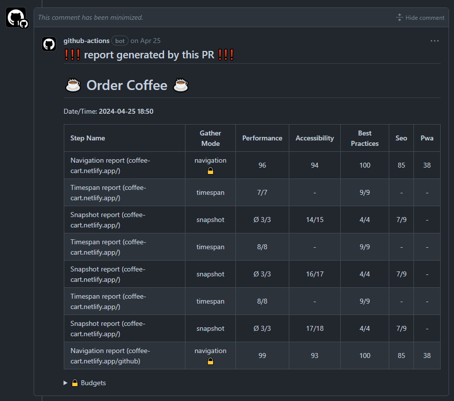

## Github Comment Report Example

This example demonstrates how you can easily take you current user-flow reports and add them as comments in a GITHUB PR

### Description

The example has a minimal user-flow and is executed in a github workflow. 

You can find the related workflow under `.github/workflows/user-flow-md-report-test.yml`.

The workflow executes user-flow then with a script transforms and renames the report. 

Then using a GITHUB action it adds it to the pull request as a comment. If there is already a report present it will minimize the previous one when adding a new one.

