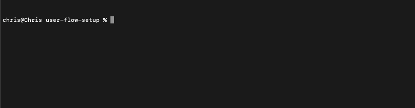

# @push-based/user-flow
## Runtime performance measurements done right, with Lighthouse user flows!

[](https://www.npmjs.com/package/%40push-based%2Fuser-flow)

---

### This is a library & CLI to organize and run Lighthouse user flows in an organized and scalable way 🛸 with CI automation in place

---

# What is it?

A CLI tool to measure performance continuously and also integrate it into your CI.
It's provides lots of DX features, nice commands with rich arguments and integration with latest dev tooling. 

# Why to use it?

It will enable you to measure bootstrap as well as runtime performance with minimum effort, 
speed up your performance test development and reduced the needed code and configuration to a minimum. 


In addition, it is always up-to-date with the latest Chrome DevTools features.

 

**Benefits**

- ⚙ Run it in your CI  
- 🏃‍♀️ Measure Runtime performance
- 🔒 Performance budgets
- 🦮 Zero setup cost
- 🤓 Excellent DX through `--dryRun` and friends 
- 🛸 Advanced architecture with UFO's
- 🔥 Write tests directly in TypeScript (we compile them live)
- 🧠 Use best practices out of the box
- 🅾 No boilerplate


# Install

Run 
`npm i @push-based/user-flow --save-dev` or `yarn add @push-based/user-flow --dev` 
to install the library.  
  
After that you can run:  
`user-flow --help`or `user-flow --help`  

## Run without install
You can also use `npx` to run it in e.g. the CI setup:
`npx @push-based/user-flow --help`
 
# Quick Start

In this quick start we can read about 2 common things, using the package in an existing project and using it in a fresh project.
Both ways require a node and npm project setup to install user-flow and folders to store the reports and test files.

0. have node [v14.X.X](https://nodejs.org/en/download/) installed  
run `node -v` and `npm -v` to check it.  

## Set up and run user flows in an existing project

In this chapter we will learn how to install and configure user flows, as well as create a first example test and see the resulting performance report.  

0. Install:

```bash
npm i @push-based/user-flow --save-dev
```

1. Set up the `.user-flowrc.json` config file

Run 
```
npx @push-based/user-flow init
```  

or if you already installed it,

```
npx user-flow init
```  

in the console and accept the default value for every question.



This results in the following file:

_./.user-flowrc.json_
```json
{
  "collect": {
    "url": "https://coffee-cart.netlify.app/",
    "ufPath": "./user-flows"
  },
  "persist": { "outPath": "./measures", "format": ["html"] }
}
```

2. The CLI automatically creates an example user-flow. (`./user-flows/order-coffee.uf.ts`) 

It is a simple navigation measurement to start from.

_./order-coffee.uf.ts_
```typescript
import {
  UserFlowInteractionsFn,
  UserFlowContext,
  UserFlowProvider
} from '@push-based/user-flow';

// Your custom interactions with the page 
const interactions: UserFlowInteractionsFn = async (ctx: UserFlowContext): Promise<any> => {
  const { page, flow, browser, collectOptions } = ctx;
  const { url } = collectOptions;

  // Navigate to coffee order site
  await flow.navigate(url, {
    stepName: 'Navigate to coffee cart',
  });

  // Select coffee

  // Checkout order

  // Submit order

};

const userFlowProvider: UserFlowProvider = {
  flowOptions: {name: 'Order Coffee'},
  interactions
};

module.exports = userFlowProvider;
```

3. Run CLI
You can directly run the cli command. The typescript files will get resolved and compiled live. 

`npx user-flow collect` or just `npx user-flow` as collect is the default.

This will execute the user flow and opens the HTML report in the browser:


For more information on how to write user-flows read in the [Writing user flows for the CLI](https://github.com/push-based/user-flow/blob/main/packages/cli/docs/writing-basic-user-flows.md) section.

Optionally you can pass params to overwrite the values form `.user-flowrc.ts` in the file directly or over the CLI:

```bash
npx user-flow --ufPath=./user-flows-new --outPath=./user-flows-reports --url=https://localhost:4200
```
  
> **🤓 DX Tip:**  
> For a faster development process you can use the `--dryRun` option to skip measurement and perform the interactions only  
> This is a multitude faster e.g. **3s** vs **53s** for a simple 2 step flow with navigation  

## Set up an empty project (optionally)

If you don't want to maintain your user flows in the same repository the following steps describe how to setup a new project.
You can skip this steps and go directly to the setup below. 

0. Create a new folder e.g. `user-flow-demo` for the user flows and initialize npm: `npm init`  

run 
```
npm version
```  

to check it.   
You should see `'user-flow-demo': '1.0.0',` as first line.

Make sure you have the CLI installed:
```bash
npm i @push-based/user-flow --save-dev
```
now you can run it directly with `user-flow`. Test it:

```bash
npx user-flow --version
```

# CLI

## Prompts and interaction

We provide general interaction through the keyboard or `stdin` directly for testing and other crazy hacks.

### Multiselect choices

 These key combinations can be used on _multiple_ choice prompts.For more details see [enquirer - multiselect](https://github.com/enquirer/enquirer/blob/master/docs/prompts/multiselect.md)

 | **command**       | **description**                                                                                                      |
 | ----------------- | -------------------------------------------------------------------------------------------------------------------- |
 | <kbd>space</kbd>  | Toggle the currently selected choice when `options.multiple` is true.                                                |
 | <kbd>number</kbd> | Move the pointer to the choice at the given index. Also toggles the selected choice when `options.multiple` is true. |
 | <kbd>a</kbd>      | Toggle all choices to be enabled or disabled.                                                                        |
 | <kbd>i</kbd>      | Invert the current selection of choices.                                                                             |
 | <kbd>g</kbd>      | Toggle the current choice group.                                                                                     |

### Multiple choices in the CLI  

To assign multiple choices to a multiselect CLI param you have to use the param multiple times.

e.g. to select multiple formats for the collect output write:  

```text
@npx @push-based/user-flow collect -f=md -f=json
```


## Global Options

| Option                       |  Type     | Default                     |  Description                                                                                               |  
|------------------------------| --------- | --------------------------- |----------------------------------------------------------------------------------------------------------- |  
| **`--help`**, **`-h`**       | `boolean` | `undefined`                 | Show help                                                                                                  |  
| **`--version`**              | `boolean` | `undefined`                 | Show version number of cli                                                                                 |  
| **`--rcPath`**, **`-p`**     | `string`  | `./user-flowrc.json`        | Path to user-flow.config.json. e.g. `./user-flowrc.json`                                                   |  
| **`--verbose`**, **`-v`**    | `boolean` | `undefined`                 | Run with verbose logging                                                                                   |  
| **`--interactive`** **`-i`** | `boolean` | `true` (`false` in CI mode) | When false questions are skipped with the values from the suggestions. This is useful for CI integrations. |  
| **`--dryRun`**               | `boolean` | `false`                     | When true the user-flow test will get executed without measures (for fast development)                     |  

## Commands 

> **💡 Pro Tip:**
> CLI arguments that accept multiple values can be set by using the param multiple times in a row:
>
> As an example we could apply two different formats as output for the `collect` command:
> `npx user-flow collect --format=json --format=md`

### `*` command

Run the default command over:  
`@npx @push-based/user-flow [options]`  

Description:  
The default command forwards all options to the [`collect`](https://github.com/push-based/user-flow/tree/main/packages/cli#collect-command).

### `init` command

Run command over:  
`@npx @push-based/user-flow init [options]`  

Description:  
This command helps you to set up a `.user-flowrc.json` and asks for input over CLI prompts.

> **🤓 DX Tip:** 
> Set up user flows in a sub directory:  
> `npx @push-based/user-flow init --rcPath ./path/to/project/.user-flowrc.json`

### `collect` command

Run command over:  
`@npx @push-based/user-flow collect [options]`  or `@npx @push-based/user-flow [options]` as it is the default command.  

Description:  
This command executes a set of user-flow definitions against the target URL and saves the output.

|  Option                            |  Type     | Default                |  Description                                                                                               |  
| ---------------------------------- | --------- | ---------------------- |----------------------------------------------------------------------------------------------------------- |  
| **`--url`**, **`-t`**              | `string`  | n/a                    | URL to analyze                                                                                             |  
| **`--ufPath`**, **`-u`**           | `string`  | `./user-flows`         | folder containing user-flow files to run. (`*.uf.ts` or`*.uf.js`)                                          |  
| **`--outPath`**, **`-o`**          | `string`  | `./measures`           | output folder for the user-flow reports                                                                    |  
| **`--serveCommand`**, **`-s`**     | `string`  | n/a                    | Runs a npm script to serve the target app. This has to be used in combination with `--awaitServeStdout`    |  
| **`--awaitServeStdout`**, **`-a`** | `string`  | `.user-flowrc` setting | Waits for stdout from the serve command to start collecting user-flows                                     |  
| **`--format`**, **`-f`**           | `string`  | `html`, `json` setting | Format of the creates reports                                                                              |  
| **`--openReport`**, **`-e`**       | `boolean` | `true`                 | Opens browser automatically after the user-flow is captured                                                |  
| **`--budget-path`**, **`-b`**      | `string`  | `./budget.json`        | Path to the lighthouse `budget.json` file                                                                  |  

## Report Formats and Viewer

You can either export the report as `HTML` or `JSON` format. The html file can be opened in any browser.

Use the `.user-flowrc.json` property `persist.format` and give an array as value. e.g. `['html']` or `['html', 'json']`.

You can also use the CLI option `--format` to choose a format.  

- single format: `@push-based/user-flow collect --format html`  
- multiple formats: `@push-based/user-flow collect --format html --format json`  

> **🤓 DX Tip:**  
> For a faster development process you can use the `--openReport` or `-e` option to automatically open the report in the browser.
> The CLI will serve either the HTML report or opens the lighthouse report viewer if only a JSON format is available and displays it there.
> e.g. `@push-based/user-flow collect --openReport`   

The json file can be drag & dropped into the [lighthouse viewer](https://googlechrome.github.io/lighthouse/viewer/). 
This format is very good for programmatic processing and foundation for most of the features of this lib. 


## Configuration

The CLI supports the official [user-flow/lighthouse configuration](https://github.com/GoogleChrome/lighthouse/blob/master/docs/configuration.md). 

# Writing user flows for the CLI

You can think of user flows as front end e2e tests which measures performance related information during the test.

## [Basic user flows](https://github.com/push-based/user-flow/blob/main/packages/cli/docs/writing-basic-user-flows.md)

**User flow measurement modes**

| Icon  | Mode       | Measure            | Performance  | Accessibility | Best Practices | SEO       | PWA       |
| ----- | ---------- | ------------------ | ------------ | ------------- | -------------- | --------- | --------- |
|  | Navigation | Page load          | 100% / 30    | 100% / 30     | 100% / 30      | 100% / 30 | ✔ / 7 |
|  | Timespan   | User Interaction   |  10  / 10    |       ❌      |   7  /  7      |     ❌    |     ❌    |
|  | Snapshot   | Current page state |   4  /  4    |  16  / 16     |   5  /  5      |   9  /  9 |     ❌    |

## [Advanced architecture](https://github.com/push-based/user-flow/blob/main/packages/cli/docs/ufo-architecture.md)

Organizing testing logic is an art. If you don't own that knowledge, the amount of low-level code get's a night mare to maintain in bigger projects...

**This is the reason we introduced UFO's!**
**Organize clutter code 👽 in developer friendly shells 🛸**

See [ufo-architecture](https://github.com/push-based/user-flow/blob/main/packages/cli/docs/ufo-architecture.md) for more details.

## [Working with DevTools Recorder exports](https://github.com/push-based/user-flow/blob/main/packages/cli/docs/recorder-exports.md)

Chrome DevTools provides a feature to help with record and exoprt user interations. 
This can replace any handwritten code and organizes interactions in a JSON structure.

This library provides a way to replay and enrich those interactions over the CLI.

See [recorder-exports](https://github.com/push-based/user-flow/blob/main/packages/cli/docs/recorder-exports.md) for more details.

## [Performance Budgets](https://github.com/push-based/user-flow/blob/main/packages/cli/docs/performance-budgets.md)

Implementing performance improvements without breaking something is hard.  
**Even harder is it, to keep it that way. 🔒**


See [performance-budgets](https://github.com/push-based/user-flow/blob/main/packages/cli/docs/performance-budgets.md) for more details.

## Debugging

`@push-based/user-flow` ships with small helpers for logging and debugging.

### `logVerbose`

A function that logs the passed string only if the CIL options `--verbose` or `-v`is true. 

**Usage**

_./order-coffee.uf.ts_
```typescript
import { logVerbose } from "@push-based/user-flow";
// ...

logVerbose('test'); 
```

`npx user-flow collect` logs nothing  
`npx user-flow collect --verbose` logs "test"  

## Examples

- [angular-movies](https://github.com/tastejs/angular-movies/tree/main/projects/movies-user-flows/src)

## Resources

- [lighthouse viewer](https://googlechrome.github.io/lighthouse/viewer/)
- [Understanding the lighthouse result](https://github.com/GoogleChrome/lighthouse/blob/master/docs/understanding-results.md)
- [lighthouse user flows](https://web.dev/lighthouse-user-flows/)
- [lighthouse user flow recorder](https://developer.chrome.com/docs/devtools/recorder/)

made with ❤ by [push-based.io](https://www.push-based.io)
