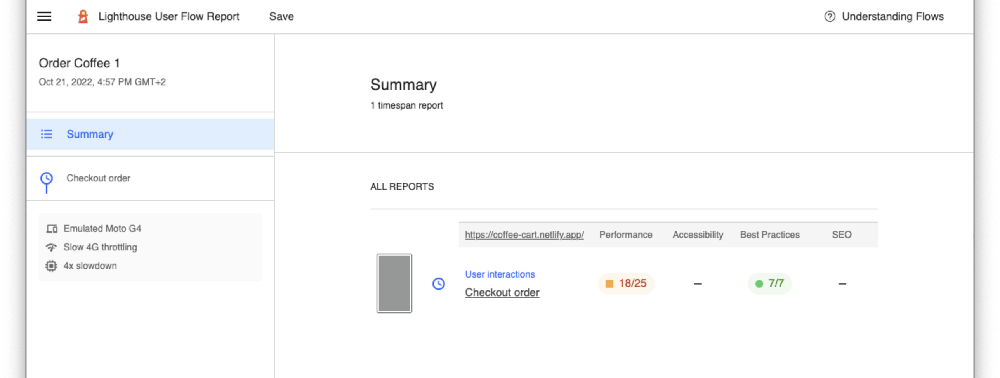
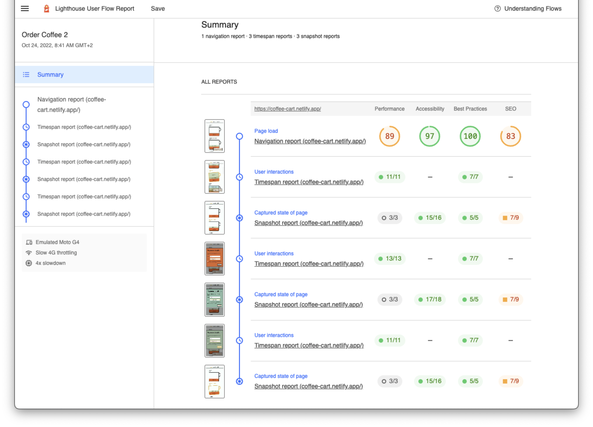
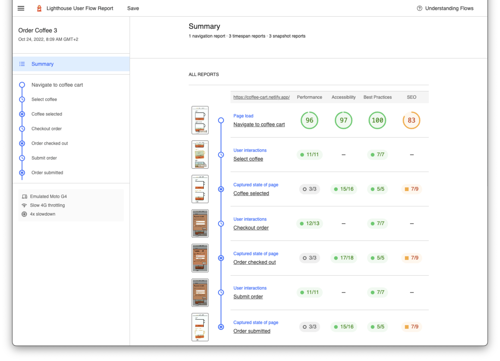

# Use DevTools Recorder exports to run user flows

If you are not familiar with the Chrome Devtools Recorder, please make sure you are aware of the following content:

- [Record, replay, and measure user flows](https://developer.chrome.com/docs/devtools/recorder/)
- [Recorder features reference](https://developer.chrome.com/docs/devtools/recorder/reference/)
- [How to edit and extend user flows with Recorder and Puppeteer Replay](https://youtu.be/LBgzmqzp7ew)

In this document we will learn:
- How to recode a user flow with chrome devtools recorder
- How to export it
- How to use it in `@push-based/user-flow`

# Initial Setup

You can find information on how to do a [basic setup](writing-basic-user-flows.md) in the docs.

We start with a basic setup of a user-flow.

```ts
import {
  UserFlowContext,
  UserFlowInteractionsFn,
  UserFlowProvider,
} from '@push-based/user-flow';

const interactions: UserFlowInteractionsFn = async (
  ctx: UserFlowContext
): Promise<any> => {
  const { flow, page, browser } = ctx;

  await flow.startTimespan({ stepName: 'Checkout order' });
  
  //... Interactions

  await flow.endTimespan();
};

const userFlowProvider: UserFlowProvider = {
  flowOptions: { name: "Order Coffee" },
  interactions,
};

module.exports = userFlowProvider;
```

# Using Recorder Replay files in Userflow

1. Use the [Chrome Devtools Recorder](https://developer.chrome.com/docs/devtools/recorder/#open) to create a user-flow recording for a specific website.
2. [Export the recording as a JSON file](https://developer.chrome.com/docs/devtools/recorder/reference/#:~:text=Export%20as%20a%20JSON%20file).
3. Store the json files in the related project e.g. under `recordings`

```bash
📦coffee-app-userflows
 ┣ 📂measures
 ┃ ┗ 📜order-coffee.uf.html
 ┣ 📂recordings
 ┃ ┗ 📜order-coffee.replay.json
 ┣ 📂user-flows
 ┃ ┗ 📜order-coffee.uf.ts
 ┗ 📜.user-flowrc.json
```

## Using the file in your user-flow

To execute the replay recording you need to
- Create and runner over `createUserFlowRunner` inside a timespan
- Run the runner inside a timespan measurement 

## Create and runner over `createUserFlowRunner` inside a timespan

```typescript
const interactions: UserFlowInteractionsFn = async (
  ctx: UserFlowContext
): Promise<any> => {
  // ...

  await flow.startTimespan({ stepName: 'Checkout order' });
  
  // Use the create function to instanciate a the user-flow runner.
  const runner = await createUserFlowRunner('./recordings/order-coffee.replay.json', ctx)
  await runner.run();

  await flow.endTimespan();
};
```

## Run the runner inside a timespan measurement 

Now you can execute it with `npx @push-based/user-flow`. 
You should see the browser opening a report.



## Separating the recording into multiple timespan's

Now that we have a basic user flow running we can add actions to get more detailed information about the different interactions. 

We can add the a set of `@push-based/user-flow` actions as simple object to the steps array:

The available types are:
- navigation
- startTimespan
- endTimespan
- snapshot

```json
[
  { "type": "startTimespan" },
  { 
    "type": "click",
    ...
  },
  { "type": "endTimespan" },
  { "type": "snapshot" }
]
```

Now that we have added the timespans in the json we need to remove the surrounding timespans:

```typescript
const interactions: UserFlowInteractionsFn = async (
  ctx: UserFlowContext
): Promise<any> => {

  const runner = await createUserFlowRunner('./recordings/order-coffee-2.replay.json', ctx);
  await runner.run();
};
```



## Combine it with custom code

We can also pass additional options to each step, such as a `stepName` the report: 

```json
[
  { 
    "type": "startTimespan",
    "stepOptions": {
      "stepName": "Select coffee"
    }
  },
  { 
    "type": "click",
    ...
  },
  { "type": "endTimespan" },
]

```



TODO => show how to wrap with timespan

# Advanced architecture

# Resources

- [User-flow Replay Example](../../user-flow-replay-example/user-flow-replay-json/)

// Compare programmatic vs recorded

// TODO add resource link
